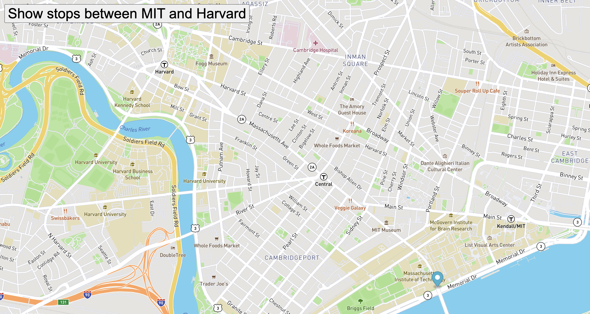

# Real-Time-Bus-Tracker

## Description 
This Project is a web page that shows the map of bus stops between MIT and Harvard. I used mapbox to create this map.

## How to Run 
Please follow this [link](https://oksanawalters.github.io/Real-Time-Bus-Tracker/) to test it yourself. When the page is loaded click on "Show stops between MIT and Harvard".

## Future Improvements 
This page can be improved by adding real time bus data in the city of Boston. Potentially adding more routs to this map.

## License Information
[MIT](https://choosealicense.com/licenses/mit/)
